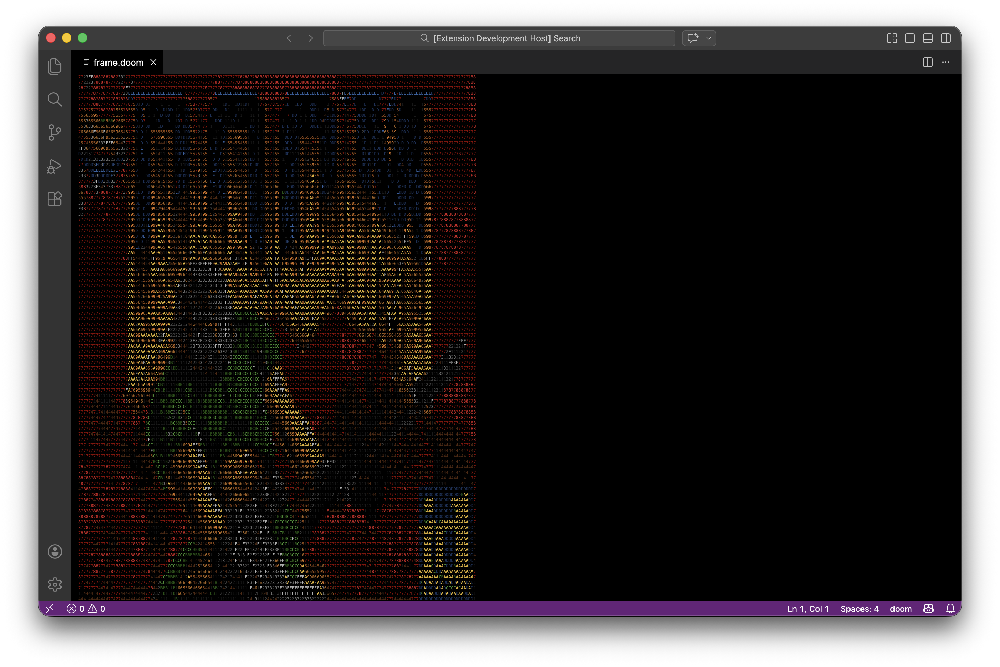

# Running DOOM in VSCode

## How does it work?
This project relies on the legendary [doomgeneric](https://github.com/ozkl/doomgeneric) repository, and implements a new VSCode code window as the screen buffer.  
It performs the following:
1. Uses color schemes to output color.
2. Overrides VS Code's built-in type command. When the active editor has a `doom://` URI scheme, keystrokes are intercepted and their char codes sent to DOOM instead of being passed through to the editor via `default:type`.
3. Registers named VS Code commands (`doom.key.up`, `doom.key.ctrl`, etc.) that map to DOOM key codes. These are bound to actual keyboard shortcuts in `package.json` keybindings with a when clause (likely `editorTextFocus && resourceScheme == 'doom'`).
4. Performs press-and-release simulations: VSCode only gives you keydown events, not keyup. So `pressAndRelease` works around this with a debounced release timer (150ms). On each keystroke, it immediately sends a key-press event to the DOOM process, and schedules a key-release 150ms later. If the same key fires again before the timer expires, the release is postponed — this keeps the key "held down" for continuous movement while the user holds the key.

The cool think - it was 100% vibe-coded using [Claude Code](https://code.claude.com/docs/en/overview).

Give it a go!

Jonathan Bar Or 
